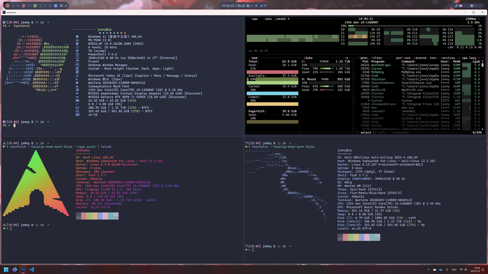

# Windows dotfiles



- Terminal Emulator: [WezTerm](../../tools/wezterm/)
- Tiling Window Manager: [GlazeWM](./glzr/glazewm/config.yaml)
- Status Bar: [Zebar](./glzr/zebar/settings.json)
- Quake Terminal: [Windows Terminal](./WindowsTerminal.json)
- Shell: [PowerShell Core](../../tools/powershell/readme.md)
  - WSL1: [Arch Linux](https://github.com/yuk7/ArchWSL)
  - WSL2: kali-linux

By following the Windows Directory Standard, assign the following directories corresponding to `$XDG_CONFIG` in Unix, some of the software(like `wezterm`) will use these directories as the default configuration path:

| Windows Path | XDG-Equivalent | Default |
|------------|----------|----------|
| `%APPDATA%` | `$XDG_CONFIG_HOME` | `%USERPROFILE%\AppData\Roaming` |
| `%LOCALAPPDATA%` | `$XDG_DATA_HOME` | `%USERPROFILE%\AppData\Local` |
| `%LOCALAPPDATA%\Cache` | `$XDG_CACHE_HOME` | `%USERPROFILE%\AppData\Local\Cache` |
| `%LOCALAPPDATA%\State` | `$XDG_STATE_HOME` | `%USERPROFILE%\AppData\Local\State` |

An example bootstrap script is provided in [bootstrap/Windows.ps1](../../bootstrap/Windows.ps1), which will create necessary directories and link the files.

## PowerShell Profile

This is the *[PowerShell Core](https://github.com/PowerShell/PowerShell)* profile, not the legacy *Windows PowerShell* profile, which is faster(`powershell` vs `pwsh`, `pwsh` types 6 letters less lol), cross-platform and compatible with Unix.

By default, PowerShell profile is stored in `%UserProfile%\Documents\PowerShell\Microsoft.PowerShell_profile.ps1`.

It is convenient to use `$PROFILE` to locate the profile file.

```powershell
Test-Path $PROFILE
```

Just like Unix Shell, there are configs work for different sessions. To locate them, use `select *` followed by `$PROFILE`.

If you want to change the `AllUsers` scoped profile, do not install `pwsh` via `winget`, use `scoop` instead, since `winget` will install `pwsh` to `%ProgramFiles%\PowerShell\7\pwsh.exe`, which is read-only even with Administrator privileges.

```powershell
PS > $PROFILE | Select *
AllUsersAllHosts       : C:\Users\jsony\scoop\apps\pwsh\current\profile.ps1
AllUsersCurrentHost    : C:\Users\jsony\scoop\apps\pwsh\current\Microsoft.PowerShell_profile.ps1
CurrentUserAllHosts    : C:\Users\jsony\Documents\PowerShell\profile.ps1
CurrentUserCurrentHost : C:\Users\jsony\Documents\PowerShell\Microsoft.PowerShell_profile.ps1
Length                 : 68
```

Note that the variable `$PROFILE.*` are constants, the only way to change it is to compile your own `pwsh`

To link the profile file:

```powershell
New-Item -ItemType SymbolicLink -Path $PROFILE -Target "$DOTFILES\win\Microsoft.PowerShell_profile.ps1" -Force
```

I use [starship](https://starship.rs/) to customize the prompt, which is located in [`tools/starship/starship_pwsh.toml`](../../tools/starship/starship_pwsh.toml). This prompt config is cross-platform for powershell core, since I use the prompt to identify the shell.

## `.wslconfig` - WSL2 Configuration

`.wslconfig` only supports `%UserProfile%\.wslconfig` as the configuration path

```powershell
New-Item -ItemType SymbolicLink -Path "$Env:UserProfile\.wslconfig" -Target "$DOTFILES\win\.wslconfig" -Force
```
<!--
## Windows Terminal

Use Hard Link to sync Windows Terminal Settings since it doesn't support symlink.

```powershell
New-Item -ItemType HardLink -Path "$Env:LocalAppData\Packages\Microsoft.WindowsTerminal_8wekyb3d8bbwe\LocalState\settings.json" -Target "$DOTFILES\win\WindowsTerminal.json" -Force
```
-->

## Neovide

Neovide configuration is (only) stored in `%APPDATA%\neovide\config.toml`

```powershell
New-Item -ItemType SymbolicLink -Path "$Env:AppData\neovide\config.toml" -Target "$DOTFILES\win\neovide.toml" -Force
```